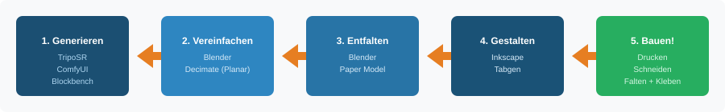

# Papercraft-KI: Pädagogische Bastelbögen mit Open-Source-KI

> **Eigene 3D-Papiermodelle generieren, entfalten und basteln – komplett mit freier Software und lokaler KI.**


[](#software-stack)
[](docs/LEHRPLAN21.md)
[](#zielgruppe)

🇬🇧 [English summary](README.en.md)

> **Status: v0.1 – Dokumentation.** Der Workflow ist beschrieben, aber noch nicht durchgehend getestet. Erstes Beispiel: der [Würfel-Bogen](examples/01-wuerfel-einstieg/) ist headless erzeugt (Blender → Paper Model → Skript → Inkscape), aber noch nicht mit Kindern gebaut; die übrigen Beispiele und Vorlagen sind Platzhalter. Erfahrungsberichte und erste Beispielprojekte sind willkommen – siehe [Mitmachen](#mitmachen).

---

## Was ist das?

Dieses Repository dokumentiert einen vollständigen **FOSS-Workflow** (Free and Open Source Software), mit dem Eltern, Lehrpersonen und Makerspaces eigene Bastelbögen (Papercraft) herstellen können – von der Idee bis zum fertigen Papierobjekt. Die Pipeline nutzt **lokale KI-Modelle** zur 3D-Generierung, benötigt keine Cloud-Dienste und ist vollständig kostenlos.

**Der Workflow in 30 Sekunden:**

```
Idee ("Feuerwehr-Truck!")
  → 3D-Modell: selbst gebaut (Blockbench) oder KI-generiert (TripoSR / TRELLIS.2)
    → Blender vereinfacht auf 20–50 Flächen
      → Paper Model Add-on entfaltet zu Schnittmuster
        → Inkscape optimiert für Kinderhände
          → Drucken, Schneiden, Falten, Kleben 🎉
```

<p align="center">
  
</p>

---

## Inhaltsverzeichnis

- [Warum dieses Projekt?](#warum-dieses-projekt)
- [Zielgruppe](#zielgruppe)
- [Pädagogischer Hintergrund](#pädagogischer-hintergrund)
- [Bezug zum Lehrplan 21](#bezug-zum-lehrplan-21)
- [Software-Stack](#software-stack)
- [Hardware-Voraussetzungen](#hardware-voraussetzungen)
- [Die Pipeline: Schritt für Schritt](#die-pipeline-schritt-für-schritt)
- [Einstiegsprojekte](#einstiegsprojekte)
- [Material und Werkzeug](#material-und-werkzeug)
- [Für Lehrpersonen](#für-lehrpersonen)
- [Weiterführende Dokumentation](#weiterführende-dokumentation)
- [Mitmachen](#mitmachen)
- [Sicherheit](#sicherheit)
- [Lizenz](#lizenz)
- [Autor](#autor)

---

## Warum dieses Projekt?

Kommerzielle Papercraft-Software wie Pepakura Designer ist kostenpflichtig und proprietär. Gleichzeitig bieten lokale KI-Modelle heute die Möglichkeit, in Sekunden 3D-Objekte zu generieren, die sich für Bastelbögen eignen. Dieses Projekt verbindet beides:

| Herausforderung | Unsere Lösung |
|---|---|
| Proprietäre Software (Pepakura) | 100 % FOSS-Stack (Blender, Inkscape, Blockbench, offene KI-Modelle) |
| Fertige Bastelbögen oft nicht altersgerecht | Schwierigkeitsgrad wird im Workflow konfiguriert |
| Cloud-Abhängigkeit bei KI-Tools | Lokale Inference, keine Daten verlassen den Rechner |
| Standardisierte Massenware | Unbegrenzte Variationen basierend auf Kinderinteressen |
| Hohe Einstiegshürde | Dokumentierter Workflow mit Einstiegsprojekten |

---

## Zielgruppe

Dieses Repository richtet sich an:

- **Eltern**, die mit ihren Kindern (5–12 Jahre) kreativ basteln möchten
- **Lehrpersonen** (Zyklus 1 und 2), die TTG-Unterricht mit digitalen Werkzeugen verbinden
- **Makerspaces und FabLabs**, die den Workflow als Workshop anbieten
- **Medienpädagog:innen**, die praktische KI-Literacy vermitteln wollen

### Altersempfehlungen für Kinder

| Alter | Schwierigkeitsgrad | Polygon-Anzahl | Laschen | Beispielprojekt |
|---|---|---|---|---|
| 5–6 Jahre | ⭐ Einstieg | 6–12 | 15 mm, Klebestift | Würfel mit Tierbildern |
| 7–8 Jahre | ⭐⭐ Mittel | 20–35 | 10–12 mm | Einfaches Fahrzeug (LKW) |
| 9–10 Jahre | ⭐⭐⭐ Fortgeschritten | 35–60 | 8–10 mm | Gebäude, Tiere |
| 11–12 Jahre | ⭐⭐⭐⭐ Anspruchsvoll | 60–100 | 5–8 mm | Detaillierte Modelle |

---

## Pädagogischer Hintergrund

Papercraft ist weit mehr als eine Bastelaktivität. Aus entwicklungspsychologischer und ergotherapeutischer Sicht fördert die Arbeit mit Schere, Papier und Klebstoff eine Reihe grundlegender Kompetenzen.

### Feinmotorik und bilaterale Koordination

Das Schneiden fordert die **bimanuelle Koordination**: Die dominante Hand führt die Schere, die nicht-dominante Hand manipuliert das Papier dynamisch. Diese **Dissoziation der beiden Körperhälften** ist fundamental für spätere Kompetenzen wie Schreiben und Schuhebinden.

**Konsequenz für den Workflow:** Der Decimate-Schritt in Blender erzeugt bewusst lange, sanfte Schnittlinien statt gezackter Kanten. Spitze Winkel unter 90° werden vermieden, um motorische Überforderung zu verhindern.

### Räumliches Vorstellungsvermögen (Spatial Reasoning)

Der Transformationsprozess von einem 2D-Netz zu einem 3D-Objekt stimuliert das räumliche Denken. Das Kind lernt, dass eine gestrichelte Linie eine Faltung bedeutet und nicht eine Trennung. Die Nummerierung benachbarter Kanten fördert das logische Denken.

**Konsequenz für den Workflow:** Faltlinien werden farblich kodiert (rot = Bergfalte, blau = Talfalte). Farbsymbole statt Zahlen machen das System auch für Kinder zugänglich, die noch nicht sicher lesen.

### Frustration vs. Flow: Die Zone der nächsten Entwicklung

Der Schwierigkeitsgrad muss die **«Zone der nächsten Entwicklung»** (Wygotski) treffen: herausfordernd genug, um spannend zu sein, aber einfach genug, um erfolgreich gebaut zu werden. Der Workflow ermöglicht diese Feinjustierung über drei Parameter: Polygon-Anzahl (Decimate Modifier), Laschengrösse (Tabgen) und Schnittlinien-Topologie (Path Simplification).

📖 **Vertiefte pädagogische Analyse:** [docs/PAEDAGOGIK.md](docs/PAEDAGOGIK.md)

---

## Bezug zum Lehrplan 21

Dieser Workflow adressiert Kompetenzen aus drei Fachbereichen des [Lehrplan 21](https://v-fe.lehrplan.ch). Die Codes wurden gegen die offiziellen Kompetenz-Poster (TTG und MA, Zyklus 1 und 2) abgeglichen; Wortlaut gekürzt.

### Textiles und Technisches Gestalten (TTG)

| Kompetenzstufe | Wortlaut LP21 (gekürzt) | Bezug zum Workflow |
|---|---|---|
| **TTG.2.A.1.a** (Z1) | Aufmerksamkeit auf ein Thema richten, Ideen sammeln und ordnen | Kind wählt das Motiv |
| **TTG.2.A.3.b** (Z2) | Bedingungen der Aufgabe für die Planung verwenden (z. B. Skizze, Plan, **Schnittmuster**) | Der Bastelbogen ist das Schnittmuster |
| **TTG.2.D.1.1a** (Z1) | Trennen: schneiden, reissen, lochen (Papier, …) | Ausschneiden der Bastelteile |
| **TTG.2.D.1.2a** (Z1) | Umformen: falten (z. B. Papier) | Falten entlang der Faltlinien |
| **TTG.2.D.1.3a** (Z1) | Verbinden: kleben (Papier, Karton, …) | Zusammenkleben der Laschen |
| **TTG.2.E.1.2a** (Z1) | Werkzeuge der feinmotorischen Entwicklung entsprechend unter Anleitung verwenden (Schere, …); Druck, Kraft, Geschwindigkeit steuern | Kinderschere, Klebstoffdosierung – der motorische Kern |
| **TTG.1.B.2.a** (Z1) | Über den erlebten Prozess berichten und Produkte zeigen; erste Fachbegriffe verwenden | Modell präsentieren; Lasche, Kante, Bergfalte, Talfalte |

### Mathematik – Form und Raum (MA.2)

| Kompetenzstufe | Wortlaut LP21 (gekürzt) | Bezug zum Workflow |
|---|---|---|
| **MA.2.A.2.f** (Z1) | Rechteck, Quadrat, Dreieck, Kreis, Kugel und Würfel zerlegen und zusammensetzen (z. B. **falten, schneiden und aufkleben**) | Wörtlich der Papercraft-Prozess |
| **MA.2.A.1.g** (Z2) | Geometrische Körper erkennen und benennen (Würfel, Quader, Kugel, Zylinder, Pyramide) | LKW = Quader + Zylinder |
| **MA.2.B.2.b** (Z2) | **Würfel- und Quadernetze durch Falten überprüfen** | Netz falten und prüfen, ob es schliesst |
| **MA.2.C.1.i** (Z2) | Aus Quadraten und Rechtecken Würfel und Quader herstellen und umgekehrt **das Netz durch Abwickeln zeichnen** | Exakt der Unfolding-Schritt |
| **MA.2.C.2.f** (Z2) | Nach bildlicher Anleitung falten | Bastelbogen mit Icon-Legende |

### Medien und Informatik (MI)

| Kompetenz | Titel LP21 | Bezug zum Workflow |
|---|---|---|
| **MI.1.3** | Medien und Medienbeiträge produzieren | Eingabebild, Bastelbogen, Prozessdokumentation |
| **MI.2.2** | Algorithmen | Bastelbogen als formale Anleitung; ComfyUI-Workflow als visueller Algorithmus |
| **MI.2.3** | Informatiksysteme | KI als Werkzeug verstehen – nicht als Magie |

### Überfachliche Kompetenzen

Der Workflow fördert explizit alle drei Bereiche der überfachlichen Kompetenzen:

- **Personale Kompetenzen:** Selbstreflexion über den eigenen Gestaltungsprozess, Eigenständigkeit bei der Motivwahl
- **Soziale Kompetenzen:** Kooperation (Eltern-Kind oder Partnerarbeit), gegenseitige Unterstützung beim Zusammenbau
- **Methodische Kompetenzen:** Informationen nutzen (Legende lesen), Probleme lösen (Konstruktionsfehler erkennen), Aufgaben planen

📖 **Detaillierte Kompetenzmatrix mit Aufgabenbeispielen:** [docs/LEHRPLAN21.md](docs/LEHRPLAN21.md)

---

## Software-Stack

Alle Tools sind kostenlos, quelloffen und lokal ausführbar.

| Schritt | Software | Lizenz | Funktion |
|---|---|---|---|
| Box-Modelling (ohne KI) | [Blockbench](https://www.blockbench.net/) | GPL-3.0 | Quader-Modelle mit perfekter Papercraft-Topologie |
| 3D-Generierung – Einstieg | [TripoSR](https://github.com/VAST-AI-Research/TripoSR) | MIT | Bild → 3D-Mesh; läuft auch auf schwacher Hardware |
| 3D-Generierung – Qualität | [TRELLIS.2](https://github.com/microsoft/TRELLIS) | MIT | Bild → 3D-Mesh; beste Geometrie unter den offenen Modellen |
| 3D-Generierung – Alternative | [Hunyuan3D 2.1](https://github.com/Tencent-Hunyuan/Hunyuan3D-2) | Tencent Community | Bild/Text → 3D; starke Texturen, eingeschränkt offene Lizenz |
| KI-Workflow | [ComfyUI](https://github.com/comfyanonymous/ComfyUI) | GPL-3.0 | Node-basierte KI-GUI |
| 3D-Verarbeitung | [Blender 4.x](https://www.blender.org/) | GPL-2.0+ | Decimation, Seams, Unfolding |
| Mesh-Analyse | [MeshLab](https://www.meshlab.net/) | GPL-3.0 | Topologie-Reparatur |
| Vektor-Layout | [Inkscape 1.x](https://inkscape.org/) | GPL-2.0 | Linienstile, Laschen, Layout |
| Laschen-Generator | Tabgen (Inkscape-Erweiterung) | GPL | Geometrische Laschen erzeugen; Bezug siehe [INSTALLATION.md](docs/INSTALLATION.md#2-inkscape-1x) |
| Plotter-Treiber | [Inkcut](https://github.com/inkcut/inkcut) | GPL-3.0 | Schneideplotter ansteuern |

> **Stand der KI-Modelle (Oktober 2026):** 3D-Generierung entwickelt sich schnell. TripoSR (2024) ist das zugänglichste Modell und läuft auch mit 6 GB VRAM. TRELLIS.2 (Dezember 2025, Microsoft, MIT-Lizenz) liefert aktuell die beste Qualität unter den frei herunterladbaren Modellen, braucht aber deutlich mehr Grafikspeicher. Für Papercraft ist Modellqualität zweitrangig, weil das Mesh ohnehin auf 20–50 Flächen reduziert wird – darum empfehlen wir den Einstieg mit TripoSR oder gleich ohne KI mit Blockbench. Vergleich und Entscheidungshilfe: [docs/WORKFLOW.md](docs/WORKFLOW.md#modellwahl-welches-ki-modell-für-welchen-zweck).

### Proprietäre Äquivalente, die dieser Stack ersetzt

```
Asset Stores / CAD        →  Blockbench / TripoSR / TRELLIS.2
MeshMixer (closed)        →  Blender / MeshLab
Pepakura Designer         →  Blender Paper Model Add-on
Adobe Illustrator         →  Inkscape + Tabgen
```

---

## Hardware-Voraussetzungen

### Ohne KI (Blockbench + Blender + Inkscape)

Für den manuellen Pfad genügt ein handelsüblicher Rechner oder Laptop. Keine GPU-Anforderungen. **Das ist der empfohlene Einstieg – und für Schulen in der Regel der einzige realistische Pfad.**

### Mit KI – Stufe 1: TripoSR

| Komponente | Minimum | Empfohlen |
|---|---|---|
| GPU | NVIDIA GTX 1060 (6 GB VRAM) | NVIDIA RTX 3060 (12 GB VRAM) |
| RAM | 16 GB | 32 GB |
| Speicher | 10 GB frei | SSD |
| OS | Linux, Windows 10+ | Ubuntu 22.04+ |
| Treiber | CUDA 11.8+ | CUDA 12.x |

TripoSR läuft notfalls auch auf der CPU (deutlich langsamer, aber funktionsfähig) und mit Einschränkungen auf Apple Silicon via MPS.

### Mit KI – Stufe 2: TRELLIS.2

| Komponente | Minimum | Empfohlen |
|---|---|---|
| GPU | NVIDIA RTX 3060 (12 GB VRAM) | NVIDIA RTX 4090 (24 GB VRAM) |
| RAM | 32 GB | 64 GB |
| Speicher | 30 GB frei | SSD |
| Treiber | CUDA 12.x | CUDA 12.x |

Der VRAM-Bedarf hängt von der gewählten Modellvariante und Auflösung ab; die Angaben im Repository des Modells sind massgebend.

---

## Die Pipeline: Schritt für Schritt

### Schritt 1: 3D-Modell generieren

**Ziel:** Ein 3D-Rohmodell des gewünschten Objekts erzeugen.

Es gibt vier Wege, geordnet nach Einstiegshürde:

#### Option A: Blockbench (manuell, ohne KI) – Empfohlener Einstieg

Modelle direkt aus Quadern zusammenbauen. Blockbench arbeitet nativ mit Cubes, was automatisch eine perfekte Papercraft-Topologie erzeugt: keine Reparatur, keine Decimation nötig. Für Projekt A (Würfel) der einzige Weg; für einfache Fahrzeuge und Gebäude oft die beste Wahl, weil das Kind selbst mitbauen kann.

#### Option B: TripoSR (Bild → 3D) – KI-Einstieg

```bash
# Umgebung einrichten (einmalig)
conda create -n triposr python=3.10
conda activate triposr
pip install torch torchvision --index-url https://download.pytorch.org/whl/cu118
git clone https://github.com/VAST-AI-Research/TripoSR.git
cd TripoSR && pip install -r requirements.txt

# 3D-Modell generieren
python run.py input_image.png --output-dir output/ --model-save-format obj
```

> **Ergebnis:** Eine `.obj`-Datei in Sekunden. Geringste Hardware-Anforderungen aller KI-Modelle; Texturen bleiben unscharf, die Geometrie ist für Papercraft nach der Vereinfachung aber gut genug.

#### Option C: TRELLIS.2 (Bild → 3D) – KI-Qualitätsstufe

Microsofts TRELLIS.2 (MIT-Lizenz) erzeugt sauberere Meshes mit weniger «schwebenden Teilen» (Floaters), die beim Papercraft zu losen Fragmenten führen würden. Braucht mehr VRAM und Einrichtungsaufwand. Lohnt sich für komplexere Objekte (Gebäude, Tiere), bei denen die Decimation sonst zu viel Handarbeit erfordert. Installation: [docs/INSTALLATION.md](docs/INSTALLATION.md#5-trellis2-ki-bild--3d-qualitätsstufe).

#### Option D: ComfyUI-Workflow (Text → Bild → 3D, vollautomatisch)

Nodes in ComfyUI verbinden:

1. **Text Prompt** → `"Low poly toy truck, flat shading, colorful, simple shapes"`
2. **Stable Diffusion** → Erzeugt 2D-Bild
3. **3D-Node** (TripoSR oder TRELLIS.2) → Konvertiert zu 3D-Mesh
4. **Save 3D** → Speichert als `.obj` oder `.glb`

> Beispiel-Workflows sind in [`templates/comfyui/`](templates/comfyui/) vorgesehen (Roadmap, noch nicht enthalten).

### Schritt 2: Geometrische Vereinfachung (Blender)

**Ziel:** Von hunderttausenden Dreiecken auf 20–50 kindgerechte Flächen.

```
1. Import:     File → Import → Wavefront (.obj)
2. Check:      3D Print Toolbox Add-on → "Check All" (Non-Manifold Edges finden)
3. Reparatur:  "Make Manifold" oder manuell im Edit Mode (F = Loch schliessen)
4. Decimation: Decimate Modifier → Modus "Planar" → Angle Limit 10–20°
5. Nacharbeit: Räder/Details durch saubere Primitives ersetzen (Cylinder, 8 Segmente)
```

> **Warum Planar?** Der Planar-Algorithmus verschmilzt Flächen mit ähnlichem Winkel. Flache Seitenwände werden zu einem Polygon, Kanten (90°) bleiben erhalten. Resultat: «Box-Modelling»-Look aus KI-Blobs – ideal für Kinder.

### Schritt 3: Nähte setzen und entfalten

**Ziel:** Das 3D-Modell in ein flaches Schnittmuster (Bastelbogen) verwandeln.

```
1. Edit Mode:  Tab-Taste → Edge Select Mode
2. Seams:      Kanten selektieren → Strg+E → Mark Seam
3. Strategie:  Nähte an Unterseite, Rückseite, natürliche Kanten
4. Export:     File → Export → Paper Model (.svg)
```

**Export-Einstellungen für Kinder:**

| Parameter | Empfehlung |
|---|---|
| Scale | Gross: z. B. 20 cm für einen LKW |
| Islands | Wenige grosse Teile (durch geschickte Seams) |
| Texturen | «From Materials», mind. 300 DPI |
| Tabs | «No Tabs» wählen → später in Inkscape via Tabgen |
| Format | **SVG** (nicht PDF!) |

### Schritt 4: Kindgerechtes Layout (Inkscape)

**Ziel:** Aus dem Rohmuster ein pädagogisch wertvolles Produkt machen.

#### Visuelle Kodierung

| Element | Darstellung | Icon |
|---|---|---|
| Schnittlinien | Schwarz, durchgezogen, 0,5–1 mm | ✂️ Schere |
| Bergfalten | Rot gestrichelt | 🔺 Berg |
| Talfalten | Blau gestrichelt | 🔻 Tal |
| Klebelaschen | Grau, dünner Rand | 💧 Klebetropfen |

#### Laschen optimieren mit Tabgen

```
1. Vorhandene Laschen-Pfade löschen
2. Kanten auswählen, die Laschen erhalten sollen
3. Erweiterungen → Papercraft → Tabgen
4. Konfiguration: Höhe 10–15 mm, Winkel 45° (Trapez)
5. Generieren
```

> ⚠️ Vorher: Alle Kurven linearisieren (Path → Object to Path)

> Ohne Tabgen oder headless: [`scripts/add_tabs.py`](scripts/add_tabs.py) ersetzt die Paper-Model-Laschen durch Trapezlaschen und setzt dabei nur eine Lasche pro Klebepaar.

#### Layout

- Teile sinnvoll auf A4-Bögen verteilen (Nesting)
- Zusammengehörige Teile gruppieren (alle Räder auf einer Seite)
- Legende mit Icons auf jedem Bogen
- Nummerierung: Farbsymbole statt Zahlen (🟡 → 🟡, ⭐ → ⭐)

> Vorlagen findest du in [`templates/inkscape/`](templates/inkscape/).

### Schritt 5: Drucken und Bauen

```
Papier:     160–200 g/m² (fest, aber druckerkompatibel)
Schere:     Kinderschere, abgerundete Spitzen, scharfe Klingen
Klebstoff:  Klebestift (sicher) oder Weissleim (stark)
Optional:   Schneideplotter via Inkcut (Teile vorperforieren)
```

📖 **Ausführliche Installationsanleitung:** [docs/INSTALLATION.md](docs/INSTALLATION.md)

---

## Einstiegsprojekte

### Projekt A: «Der erste Würfel» (ab 5 Jahre)

**Dauer:** 30 Min. digital + 20 Min. basteln | **Kein KI nötig**

1. Blockbench: «Generic Model» erstellen (ein Würfel)
2. Seiten bemalen: Zahlen 1–6 oder Tierbilder (Pixel-Art)
3. Export als `.obj`
4. Blender: Import → Paper Model Export (5–8 cm Kantenlänge)
5. Inkscape: Laschen auf 15 mm, dicke Schnittlinien

### Projekt B: «Der LKW» (ab 7 Jahre)

**Dauer:** 1–2 Std. digital + 45 Min. basteln | **KI-Workflow**

1. KI: Eingabebild → TripoSR (oder TRELLIS.2) → `.obj`
2. Blender: Planar Decimate (Angle 15°), Räder durch Zylinder ersetzen
3. Seams setzen: Kabine als ein Teil («Shell-Unfolding»)
4. Inkscape: Layout auf 2–3 A4-Seiten, Farbkodierung, Legende

> Weitere Projekte und Schwierigkeitsgrade: [`examples/`](examples/)

---

## Material und Werkzeug

### Papier

| Grammatur | Eigenschaft | Empfehlung |
|---|---|---|
| 80 g/m² | Standard-Kopierpapier | ❌ Wellt beim Kleben |
| 120 g/m² | Leicht verstärkt | Nur für flache Modelle |
| **160 g/m²** | **Festes Papier** | **✅ Ideal für Kinder** |
| 200 g/m² | Leichter Karton | ✅ Sehr stabil, noch druckbar |
| 250 g/m²+ | Karton | Nur mit Plotter schneidbar |

### Klebstoff

- **Klebestift:** Sicher, lösungsmittelfrei, gut für grosse Laschen
- **Weissleim:** Stärkste Haftung, trocknet transparent – in kleine Fläschchen mit Dosierspitze umfüllen

### Schneidewerkzeuge

- **Kinderschere:** Abgerundete Spitzen, aber scharfe Klingen (stumpf = Frust)
- **Falzbein/Lineal:** Zum Vorprägen der Faltlinien
- **Optional:** Schneideplotter (Silhouette/Cricut) mit [Inkcut](https://github.com/inkcut/inkcut)

---

## Für Lehrpersonen

### Einbettung im Unterricht

Dieser Workflow eignet sich besonders für:

- **TTG-Unterricht** (Zyklus 1 und 2): Gestalterische und technische Verfahren
- **Mathematik** (Geometrie): Körpernetze, räumliches Vorstellungsvermögen
- **Medien und Informatik**: KI als Werkzeug verstehen, Produktionsprozesse
- **Fächerübergreifende Projekte**: NMG + TTG + MI

### Differenzierung

Der Workflow ermöglicht einfache **Differenzierung** über drei Stellschrauben:

1. **Polygon-Anzahl** (Blender Decimate): Weniger Polygone = einfacher
2. **Laschengrösse** (Inkscape Tabgen): Grössere Laschen = einfacher
3. **Vorperforierung** (Schneideplotter): Eliminiert den Schneideschritt

### Workshop-Format (90 Min.)

```
00–10 Min:  Einführung: Was ist Papercraft? Beispiele zeigen
10–25 Min:  Gemeinsam: Motiv wählen, KI-Generierung beobachten
25–40 Min:  Demo: Blender-Vereinfachung (Lehrperson)
40–55 Min:  Gemeinsam: Inkscape-Layout anpassen
55–90 Min:  Basteln: Schneiden, Falten, Kleben
```

📖 **Detaillierte LP21-Kompetenzmatrix:** [docs/LEHRPLAN21.md](docs/LEHRPLAN21.md)
📖 **Pädagogische Grundlagen:** [docs/PAEDAGOGIK.md](docs/PAEDAGOGIK.md)

---

## Weiterführende Dokumentation

| Dokument | Inhalt |
|---|---|
| [docs/INSTALLATION.md](docs/INSTALLATION.md) | Detaillierte Installationsanleitung für alle Tools |
| [docs/WORKFLOW.md](docs/WORKFLOW.md) | Technischer Deep-Dive in jeden Pipeline-Schritt |
| [docs/PAEDAGOGIK.md](docs/PAEDAGOGIK.md) | Entwicklungspsychologische Grundlagen |
| [docs/LEHRPLAN21.md](docs/LEHRPLAN21.md) | Vollständige Kompetenzmatrix mit Aufgabenbeispielen |
| [templates/](templates/) | ComfyUI-Workflows, Inkscape-Vorlagen, Legenden (Roadmap) |
| [examples/](examples/) | Beispielprojekte nach Schwierigkeitsgrad (Roadmap) |

---

## Danksagung

Dieses Projekt basiert auf den hervorragenden Open-Source-Communities rund um [Blender](https://www.blender.org/), [Inkscape](https://inkscape.org/), [Blockbench](https://www.blockbench.net/), [TripoSR](https://github.com/VAST-AI-Research/TripoSR), [TRELLIS](https://github.com/microsoft/TRELLIS) und [ComfyUI](https://github.com/comfyanonymous/ComfyUI).

---

## Changelog

Siehe [CHANGELOG.md](CHANGELOG.md).

---

## Mitmachen

Beiträge sind willkommen – siehe [CONTRIBUTING.md](CONTRIBUTING.md).

Besonders gesucht:
- Erfahrungsberichte aus dem Unterricht oder von zu Hause, mit Fotos
- Beispielprojekte mit allen Zwischendateien (`.obj`, `.svg`) für `examples/`
- Inkscape-Vorlagen (Legenden, Symbole, Farbschemata) für `templates/`
- ComfyUI-Workflows für spezifische Objekttypen
- Korrekturen an der Lehrplan-Zuordnung durch Fachpersonen

---

## Sicherheit

Dieses Repository enthält nur Dokumentation und Vorlagen, keinen ausführbaren Code. Hinweise zu problematischen Inhalten oder Links bitte wie in [SECURITY.md](SECURITY.md) beschrieben melden.

---

## Lizenz

MIT-Lizenz – siehe [LICENSE](LICENSE). Du darfst den Workflow frei nutzen, anpassen und weitergeben, auch für den Unterricht.

---

## Autor

Hayal Özkan · [malkreide](https://github.com/malkreide)

Ein privates Projekt. Keine offizielle Publikation einer Behörde oder Schule.

---

<p align="center">
  <i>«Der Schlüssel liegt nicht in der Komplexität der KI, sondern in der Reduktion.»</i>
</p>
