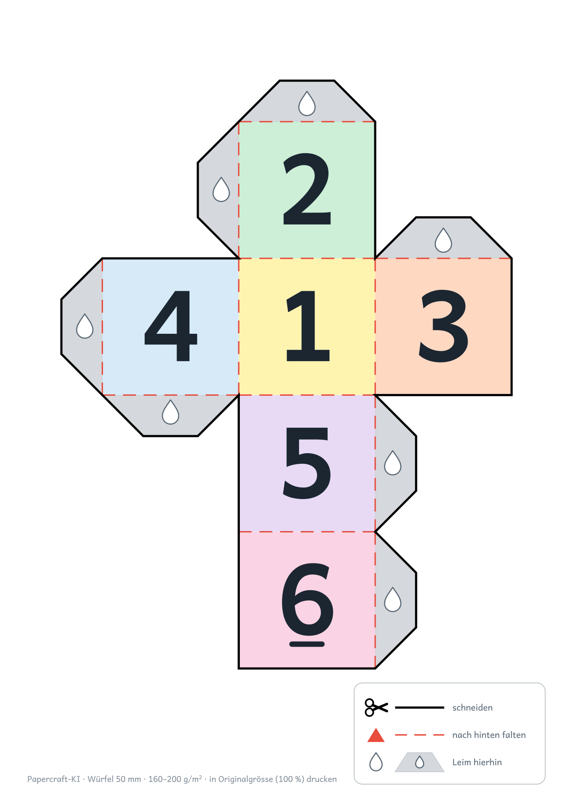
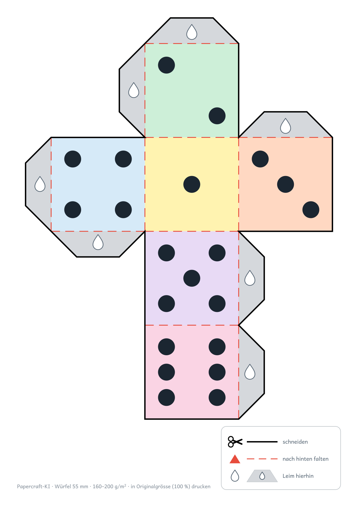

# Projekt A: «Der erste Würfel» (ab 5 Jahren)

> **Stand 9. Oktober 2026: digital erzeugt, noch nicht gebaut.** Die Dateien sind headless mit Blender, Paper Model und Inkscape entstanden. Ein Bau mit Kindern steht aus – Zeitaufwand und Foto folgen danach (Roadmap).

<p align="center">
  
  
</p>

## Zielgruppe

- Kindergarten / 1. Klasse (5–6 Jahre), mit erwachsener Begleitung beim Schneiden
- Gestaltung nach [docs/PAEDAGOGIK.md](../../docs/PAEDAGOGIK.md), Abschnitt «5–6 Jahre»: 6 Flächen, nur gerade Schnittlinien, Laschen 15 mm trapezförmig, Icons statt Text

## Dateien

| Datei | Inhalt | Erzeugt mit |
|---|---|---|
| `wuerfel.obj` | Würfel, Kantenlänge 1 Einheit | Von Hand geschrieben (entspricht einem Blockbench-Würfel) |
| `wuerfel-unfolded.svg` | Entfaltetes Netz mit kleinen Paper-Model-Laschen | `scripts/unfold_obj.py` (Blender 4.0.2, Paper Model 1.2) |
| `wuerfel-final.svg` | Fertiger Bogen, Inkscape-Ebenen, editierbar | `scripts/make_wuerfel_final.py` |
| `wuerfel-final.pdf` | Druckfertig, A4 hochkant, Text in Pfade umgewandelt | Inkscape 1.2.2 |
| `wuerfel-final-preview.png` | Vorschau 150 dpi | Inkscape 1.2.2 |
| `wuerfel-augen-final.svg`, `.pdf`, `-preview.png` | Variante mit Würfelaugen statt Ziffern | `scripts/make_wuerfel_final.py --motiv augen`, Inkscape 1.2.2 |

## Einstellungen

| Parameter | Wert | Quelle |
|---|---|---|
| Kantenlänge | 55 mm (Paper Model `--scale 18.181818` = 1000/55); grösster Wert, bei dem Netz und Legende mit 10 mm Rand auf A4 passen | PAEDAGOGIK: mindestens 5 cm |
| Netzform | Kreuz (3 × 4 Flächen), von Paper Model gewählt | – |
| Papierformat | A4 hochkant, 10 mm Rand | README «Schritt 4» |
| Schnittlinien | Schwarz, 0,8 mm, durchgezogen | README «Schritt 4» |
| Faltlinien | Rot gestrichelt (5/3, je Linie gestreckt), 0,5 mm – alle 5 Flächenfalten und 7 Laschenfalten sind Bergfalten | WORKFLOW «Linienstile» |
| Klebelaschen | 7 Stück, 15 mm hoch, Trapez 45°, grau mit Klebetropfen | PAEDAGOGIK «5–6 Jahre» |
| Flächen | Zahlen 1–6, Schrift Andika Bold (≈ 28 mm Ziffernhöhe), helle Flächenfarben; Gegenseiten ergeben 7 wie beim Spielwürfel; die 6 ist unterstrichen | – |
| Würfelaugen (Variante) | Durchmesser 18 % der Kante (≈ 10 mm), Anordnung wie beim Spielwürfel, gleiche Flächenfarben und Gegenseiten-Summe 7 | – |
| Legende | `templates/inkscape/legende-zyklus1.svg`, ohne Talfalte (kommt nicht vor) | – |

Die Laschen sitzen nur an einer Kante je Klebepaar (7 statt 14). Welche Kante, entscheidet Paper Model aus dem 3D-Modell; `scripts/add_tabs.py` vergrössert diese Laschen auf 15 mm und prüft, dass sich keine überlappen.

## Neu erzeugen

PowerShell, jeweils eine Zeile, aus dem Repo-Stammverzeichnis:

```powershell
blender --background --python scripts/unfold_obj.py -- examples/01-wuerfel-einstieg/wuerfel.obj examples/01-wuerfel-einstieg/wuerfel-unfolded.svg --scale 18.181818
python scripts/make_wuerfel_final.py examples/01-wuerfel-einstieg/wuerfel-unfolded.svg examples/01-wuerfel-einstieg/wuerfel-final.svg
python scripts/make_wuerfel_final.py examples/01-wuerfel-einstieg/wuerfel-unfolded.svg examples/01-wuerfel-einstieg/wuerfel-augen-final.svg --motiv augen
inkscape examples/01-wuerfel-einstieg/wuerfel-final.svg --export-type=pdf --export-text-to-path --export-filename=examples/01-wuerfel-einstieg/wuerfel-final.pdf
inkscape examples/01-wuerfel-einstieg/wuerfel-final.svg --export-type=png --export-dpi=150 --export-background=white --export-filename=examples/01-wuerfel-einstieg/wuerfel-final-preview.png
```

Für die Augen-Variante dieselben zwei `inkscape`-Zeilen mit `wuerfel-augen-final` statt `wuerfel-final`.

Zum Bearbeiten des SVG in Inkscape sollte die Schrift [Andika](https://software.sil.org/andika/) (SIL, Open Font License) installiert sein; sonst fällt Inkscape auf eine Ersatzschrift zurück. Das PDF ist davon unabhängig.

## Drucken und Bauen

- Papier 160–200 g/m², **in Originalgrösse (100 %)** drucken, nicht «an Seite anpassen»
- Ablauf (ungetestet): ausschneiden, Erwachsene helfen an den Laschenecken → alle roten Linien nach hinten falten → Laschen mit Klebestift einstreichen → zusammenkleben

## Offene Punkte

- Realer Bau mit Kindern: Zeitaufwand, Schwierigkeiten, Foto (ohne erkennbare Gesichter)
- Prüfen, ob 15-mm-Laschen beim 55-mm-Würfel innen anstossen (Laschen benachbarter Kanten treffen sich im Würfelinneren)
- Mit Kindern erproben, welche Variante besser funktioniert: Ziffern oder Würfelaugen (Mengenbild, auf einen Blick erfassbar)
